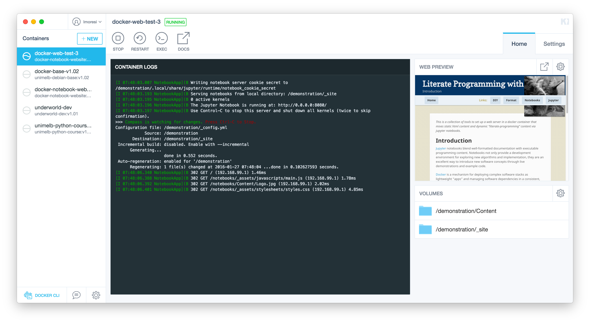

_This is the non-trivial part of the instruction manual ... using this template to make your content available to other people_

# Getting started

Ultimately you probably want to [fork this project](https://github.com/lmoresi/docker-website-notebooks), build a new docker image with your own software stack, and replace my content with something more relevant. The [docker website](https://www.docker.com/products/docker-toolbox) has many tutorials on learning how to become fluent with images / containers and you will have to visit there to grab a copy of the docker binaries.

As a first step, though, you can use the docker VOLUMEs to over-ride my content and also to capture the results of rebuilding the site and editing notebooks.

When the container is running (in kitematic) it looks like this:

Clicking on the preview brings up the web content in the default browser (by default _this content_ !).

The volumes within the container that can be used to exchange data are listed below the preview. You can connect both these to local directories in the settings and use the running container to test / build / debug your content. I will leave you to figure out how to do that from the Kitematic documentation !

You can start by pointing the `/demonstration/Content` VOLUME at a local copy of the original content grabbed from github.

# Background

We use the [jupyter](www.jupyter.org) notebook system as the webserver. This is necessary because we want to mix live content with static content but docker means we don't really know our IP address or port - we have to make links entirely within the one server. This is not a big deal but does constrain how we structure the website and links.

The site is built using [jekyll](http://jekyllrb.com) which combines a pile of markdown files plus stylesheets and produces an elegant, entirely static website. Jekyll is deployed by github to make websites from repositories that they host (and I use this for [www.moresi.info](http://www.moresi.info)). The plus side is that you need only think about markdown and not stylesheets but, of course there is a layer of additional logic and more to learn.

# My Content !

Jekyll will take any markdown files it finds in the `/demonstration/Content` directory and render them into html files in the `/demonstration/_site/Content` directory. There must be some metadata provided at the top of these files (as in the examples). There is more data in the `_config.yml` file which is used to set paths, choose links for the navigation buttons, choose a logo image etc etc. Learn from the examples and don't change anything until it is obvious what it does ! Any file or directory that starts with a `_` is either special or ignored by jekyll. Once you figure out how to change those files, you won't need to use this project at all !

There must be an `index.md` file which will be the landing page for the website and the target of the **Home** button.
There can be any number of other pages. If you want to make links to those pages from the notebooks or from the jekyll markdown files, then you need to make those links point to the html version of the file. For example, if you create a file  `/demonstration/Content/MyFiles/test.md` then you can write a link to this in markdown as `[my test file](/files/Content/MyFiles/test.html)`.

The jupyter notebook server makes a distinction between files which are linked as `/files/Content` which are rendered directly by the webserver, and files which are linked `/notebooks/Content` which are rendered by the live notebook system. If the file is actually a notebook, then it is obvious why you should link `/notebooks/file.ipynb` but if it is an html file, for example, then `files/file.html` will show you a preview whereas `/notebooks/file.html` will open the source in an editor.

## How to build it

The repository contains all the scripts and style information to build a website from the content which it finds in the `Content` directory (actually `/demonstration/Content`). All the directories with names that start with `_` are part of that magic. To build the website run this command in the container's command line (in Kitematic, the execute button will start a shell for you)


$ _scripts/docker-site-builder   #_ scripts are executable  


You will need to view that site using the jupyter notebooks rather than a standard server or directly from the filesystem as the paths are only valid within that environment.

## Where to put it

All of the material that creates the web pages and notebooks should live in the `Content` directory.

Paths are mapped from the `Content` directory to the `_site` directory in an obvious way  (this can be subverted if you add `permalink` metadata to a file) which means that links can be written in a predictable manner.

Notebooks live in `Content/Notebooks` so that, by default, the navigation bar knows where to find them.

# The Dockerfile

The unix environment you are working in depends on the setup of your Docker machine. This is determined from the `Dockerfile` in the home directory. The `FROM` command at the start of this file is the base image that is downloaded as the starting point. This contains all the dependencies you need to run live demonstrations (including the notebooks server, the jekyll system and so on).

The Dockerfile in this repository builds upon the python installation and adds the web-building tools and the content.

You will need to customise this !
